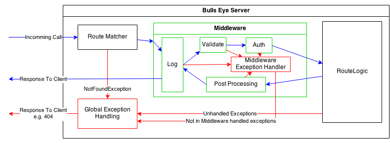

#Middleware

The workflow of Bulls-Eye with an example middleware:
;

As you can see in the diagram, with the middleware you can add common tasks (like validation, auth, ...) to the middleware instead of handling this in each route logic seperate.

To use a middleware on an route, you have to define your different middleware combinations (e.g. one for password protected areas and one for public areas).

You can create a middleware by call `middleware` of the `Server` class:
```dart
Middleware middleware(String name);
```
Parameter:
* **Name**: This is an unique name or key which identify the middleware to reuse it on different routes (e.g. `public` for the public middleware and `password` for the password protected middleware).

The middleware architecture use the **AOP** (Aspect Oriented Programming) Style.
With the returned `Middleware`object you can add code on different positions of the route logic call. The middleware supports the following hooks:
* before
* after
* around
* onError
* add

All Middleware functions are getting the current `ReqResContext` as parameter. This way you can store e.g. loaded user data to the context to reuse it in later middlewares or in the route logic.

All Middleware functions (`before`, `after` and `around`) are supporting async code executing by returning a future (e.g. loading the user data from the database in an Auth middleware).

##Before

You can add code to the route executing which is called before the route logic is called (in the example above the `Validate` and `Auth` middleware are example for that type).

You can add an before middleware by calling the function `before` on the return `Middleware` object:
```dart
before(Future func(ReqResContext context));
```


##After

You can add code to the route executing which is called after the route logic is called (in the example above the `Post Prcessing` middleware in an example for that type).

You can add an after middleware by calling the function `after` on the return `Middleware` object:
```dart
after(Future func(ReqResContext context));
```

##Around

You can add code to the route executing which is called around the route logic is called (in the example above the `Log` middleware in an example for that type).

You can add an after middleware by calling the function `around` on the return `Middleware` object:
```dart
around(Future func(ReqResContext context, MiddlewareController midCtrl));
```
Addtional to the `ReqResContext` object, the around middleware gets am `MiddlewareController`instance. This is required to define on which position in you around code you want to call the next step in the middleware queue.

Here an example:
```dart
Future aroundExample(context, midCtrl) {
  // put here the code before the next step is executed

  // execute the next step
  return midCtrl.next()
                .then((_) {
                  // put here the code which should execute after the call comes back from the next step
                });
}
```
**Attantion:** Its important that you use the Future-API for the next-call. Otherwise you call order can be different to the expected one.

##OnError

With this handle you can implement Middleware specific exception handling. By default all exceptions in an middleware are return to the global exception handling in the server. But for some cases it could be interesting to implement an custom error handling.

You can do that by calling the function `onError` on the `Middleware` object:
```dart
bool onError(Future func(ReqResContext context, MiddlewareError error))
```

##Add

Sometime is a function call not enough for an middleware implementation (e.g. if you want to initialize your middleare code with some parameter). Than you can use this function.

To use this, inherit from one of the following classes and add an instance of the class to the middleware:
* `BeforeHook`: Class for a before hook
* `AfterHook`: Class for an after hook
* `AroundHook`: Class for an around hook

**Example**
```dart

class LogMiddleware implements AroundHook {
  String logFile = "default.txt";

  LogMiddleware(this.logFile);

  Future around(context, ctrl) {
  	// Log code to defined file here
  }
}

// ...

server..middleware("Log to File A").add(new LogMiddleware("FileA.txt"))
      ..middleware("Log to File B").add(new LogMiddleware("FileB.txt"))

```