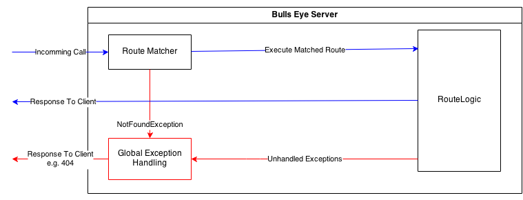

#Server

The Bulls-Eye server is the main class in the server-side Bulls-Eye framework.

The server currently support the following functions:
* Defining route based on the URL defenition
* Adding middleware code
* Hosting the server


##Basics

###Creating a Bulls-Eye server
You can create an Bulls-Eye `Server` with the following constructors:
```dart
// Default constructor
Server({bool debug: false});
```
Default constructor parameter:
* **debug *(optional, default: false)* **: This is optional and controls curretly the log outputs to the console

###The ReqResContext
The `ReqResContext` is an object which is created for each incoming call. It has the following properties:
* **request**: Contains the `HttpRequest` of the dart IO framework.
* **currentRoute**: Contains the URL defenition of the current called route. Use this e.g. in Middleware to identify the current called URL if your middleware code is reused over several routes.
* **variables**: Contains all variables which was defined by the `URL` and extracted from the called URL.
* **contextData**: This is an map where you can store data to reuse it over the call executing (e.g. store user data in an Auth-Middleware and use it in your route logic or store the database connection during the route executing).

##Route

The basic workflow of Bulls-Eye is as followed:
;

You have to define which routes (URLs) your Bulls-Eye server should handle. to do this, you have to call the function `route` of the `Server`class:
```dart
route(String method, common.Url url, RouteLogic logic, {List<String> contentTypes, String middleware});
```
Parameter:
* **method**: The method defines which HTTP method the route should handle (GET, PUT, DELETE, ...)
* **url**: An instance of an `URL` object which defines which URL the route should handle ([see here](../URLDefenitions.dart))
* **logic**: Defines which route logic should be executed if the defined URL was called ([see later](#route-logic)).
* **contentTypes *(optional, default null)* **: Defines optional which contentType on this route are allowed (Content Negotiation). This way you can define that an API request only support JSON or that the call to the home route only supports HTML.
* **middleware *(optional, default null)* **: Defines which middleware defenition should be executed with this route ([see later](#middleware))

###Route Logic
Currently Bulls-Eye supports 2 route logics:
* `LoadFile`: This route logic loads a file from the file system and returns this to the client.
* `ExecuteCode`: Executes some custom code (like loading data from the database).
* `Custom`: You can create custom route logics objects to reuse your code.

####LoadFile
`LoadFile` has the following named constructors:
```dart
LoadFile.fromUrl();

LoadFile.fromPath(String filePath);
```
* **fromURL**: This route logic requires and `URL` defenition with an wildcard. It takes the whole wildcard part and loads the file from this path (e.g. you have the URL defenition `/css/*` and the client makes a call to the url `/css/lib/bootstrap/css/bootstrap.css` than the route logic takes the wildcard part `lib/bootstrap/css/bootstrap.css` and looks for this in the file system). This is useful to deliver the CSS ans JS files.
* **fromPath**: This route logic takes a fix path to a file, which sould be delivered on call. This is helpful to deliver HTML files (e.g. the `index.html` on the home call).

####Execute Code

`ExecuteCode` has the following constructor:
```dart
ExecuteCode(bool CodeCall(ReqResContext context));
```
It takes a function handle to the code, which should be execute if the URL is called.

####Custom Route Logic

You can create custom reusable route logic by implementing the following interface:
```dart
abstract class RouteLogic {

  void execute(ReqResContext context);

  void onError(RouteLogicError errorHandler);

}
```
Functions:
* **execute**: will be called when the route logic comes to execute.

* **onError**: will be called if the route logic has an unhandled exception.

##Middleware

The workflow of Bulls-Eye with an example middleware:
;

As you can see in the diagram, with the middleware you can add common tasks (like validation, auth, ...) to the middleware instead of handling this in each route logic seperate.

To use a middleware on an route, you have to define your different middleware combinations (e.g. one for password protected areas and one for public areas).

You can create a middleware by call `middleware` of the `Server` class:
```dart
Middleware middleware(String name);
```
Parameter:
* **Name**: This is an unique name or key which identify the middleware to reuse it on different routes (e.g. `public` for the public middleware and `password` for the password protected middleware).

With the returned `Middleware`object you can define which code should execute at which point of the route executing. The middleware supports the following hooks:
* before
* after
* around
* onError

All Middleware functions are getting the current `ReqResContext` as parameter. This way you can store e.g. loaded user data to the context to reuse it in later middlewares or in the route logic.

All Middleware functions (`before`, `after` and `around`) are supporting async code executing by returning a future (e.g. loading the user data from the database in an Auth middleware).

###Before

You can add code to the route executing which is called before the route logic is called (in the example above the `Validate` and `Auth` middleware are example for that type).

You can add an before middleware by calling the function `before` on the return `Middleware` object:
```dart
before(Future func(ReqResContext context));
```


###After

You can add code to the route executing which is called after the route logic is called (in the example above the `Post Prcessing` middleware in an example for that type).

You can add an after middleware by calling the function `after` on the return `Middleware` object:
```dart
after(Future func(ReqResContext context));
```

###Around

You can add code to the route executing which is called around the route logic is called (in the example above the `Log` middleware in an example for that type).

You can add an after middleware by calling the function `around` on the return `Middleware` object:
```dart
around(Future func(ReqResContext context, MiddlewareController midCtrl));
```
Addtional to the `ReqResContext` object, the around middleware gets am `MiddlewareController`instance. This is required to define on which position in you around code you want to call the next step in the middleware queue.

Here an example:
```dart
Future aroundExample(context, midCtrl) {
  // put here the code before the next step is executed

  // execute the next step
  return midCtrl.next()
                .then((_) {
                  // put here the code which should execute after the call comes back from the next step
                });
}
```
**Attantion:** Its important that you use the Future-API for the next-call. Otherwise you call order can be different to the expected one.

####OnError

With this handle you can implement Middleware specific exception handling. By default all exceptions in an middleware are return to the global exception handling in the server. But for some cases it could be interesting to implement an custom error handling.

You can do that by calling the function `onError` on the `Middleware` object:
```dart
bool onError(Future func(ReqResContext context, MiddlewareError error))
```
